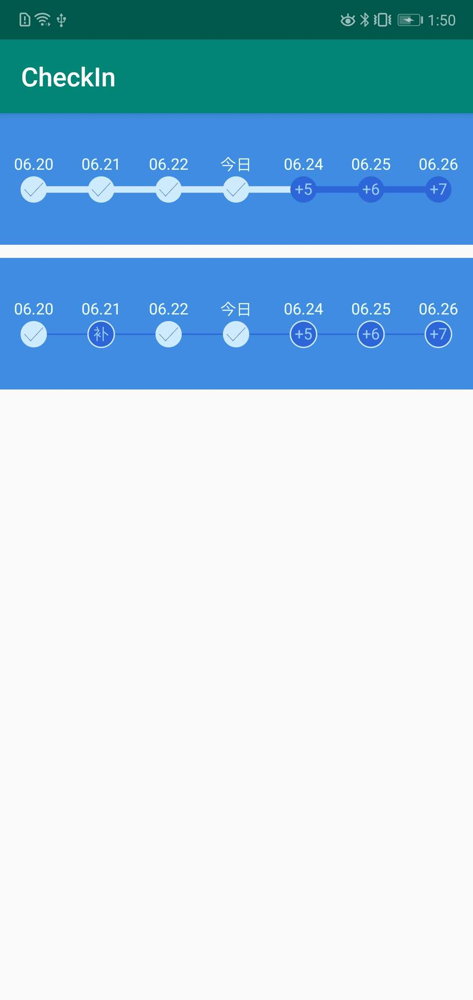

#### 一款签到控件
引用   
    
    implementation 'com.lishang:checkInProgress:1.0.1'

| 属性 | 类型 | 描述 |
| ------ | ------ | ------ |
| text_date_size | sp | 日期文字大小 |
| text_date_color | color | 日期文字颜色 |
| radius | dp | 签到圆半径 |
| circle_color | color | 圆的背景色 |
| line_height | dp | 线高 |
| line_color | color | 线的颜色 |
| text_score_size | sp | 签到积分字体大小 |
| text_score_color | color | 签到积分文字颜色 |
| check_in_bitmap | drawble | 签到后的图片 |
| check_in_color | color | 没有签到图片时，签到的颜色 |
| check_in_hook_color | color | 没有签到图片时，签到内部勾的颜色|
| check_in_hook_size | dp | 没有签到图片时，签到内部勾的大小 |
| circle_margin | dp | 签到圆顶部与日期字体距离 |
| circle_stroke_width | dp | 签到圆描边宽度 |
| circle_stroke_color | color | 签到圆边描颜色 |
| check_in_progress_show | boolean | 是否显示签到进度 |
| check_in_progress_color | color | 签到进度颜色 |
| check_in_leak_show | boolean | 是否支持补签 |
| circle_style | enum | 签到圆样式 fill 填充 stroke描边（circle_stroke_width、circle_stroke_color生效） |
| align | enum | 位置 top/center/bottom |

    <com.lishang.checkin.CheckInProgress
        android:id="@+id/checkIn_1"
        android:layout_width="match_parent"
        android:layout_height="100dp"
        android:layout_gravity="center_horizontal"
        android:layout_marginTop="10dp"
        android:background="#408ce2"
        app:align="center"
        app:check_in_color="#ceebfd"
        app:check_in_hook_color="#2d66d9"
        app:check_in_leak_show="true"
        app:circle_color="#2d66d9"
        app:circle_margin="5dp"
        app:circle_stroke_color="#ceebfd"
        app:circle_stroke_width="1dp"
        app:circle_style="stroke"
        app:line_color="#2d66d9"
        app:line_height="1dp"
        app:radius="10dp"
        app:text_date_color="#edffff"
        app:text_date_size="12sp"
        app:text_score_color="#9bccff"
        app:text_score_size="12sp" />

#

    checkIn.setAdapter(new CheckInProgress.Adapter() {
            /**
             * 日期
             * @param position
             * @return
             */
            @Override
            public String getDateText(int position) {
                CheckIn in = list.get(position);
                return in.date;
            }

            /**
             * 积分
             * @param position
             * @return
             */
            @Override
            public String getScoreText(int position) {
                CheckIn in = list.get(position);
                return in.score;
            }

            /**
             * 是否签到
             * @param position
             * @return
             */
            @Override
            public boolean isCheckIn(int position) {
                CheckIn in = list.get(position);
                return in.isCheckIn;
            }

            /**
             * 数量
             * @return
             */
            @Override
            public int size() {
                return list.size();
            }

            /**
             * 是否支持补签
             * @param position
             * @return
             */
            @Override
            public boolean isLeakCheckIn(int position) {
                CheckIn in = list.get(position);

                return in.isLeakChekIn;
            }
        });

#
    checkIn.setOnClickCheckInListener(new                     OnClickCheckInListener() {
            @Override
            public void OnClick(int position) {
                CheckIn checkIn = list1.get(position);
                if (checkIn.isCheckIn) {
                    Toast.makeText(getApplicationContext(), "已签到", Toast.LENGTH_SHORT).show();
                } else {
                    if (checkIn.isLeakChekIn) {
                        Toast.makeText(getApplicationContext(), "补卡", Toast.LENGTH_SHORT).show();
                        checkIn.isLeakChekIn = false;
                        checkIn.isCheckIn = true;

                        Log.e("CheckIn", Arrays.toString(list1.toArray()));

                        checkIn.getAdapter().notifyDataSetChanged();
                    } else {
                        Toast.makeText(getApplicationContext(), "签到", Toast.LENGTH_SHORT).show();
                    }
                }
            }
        });